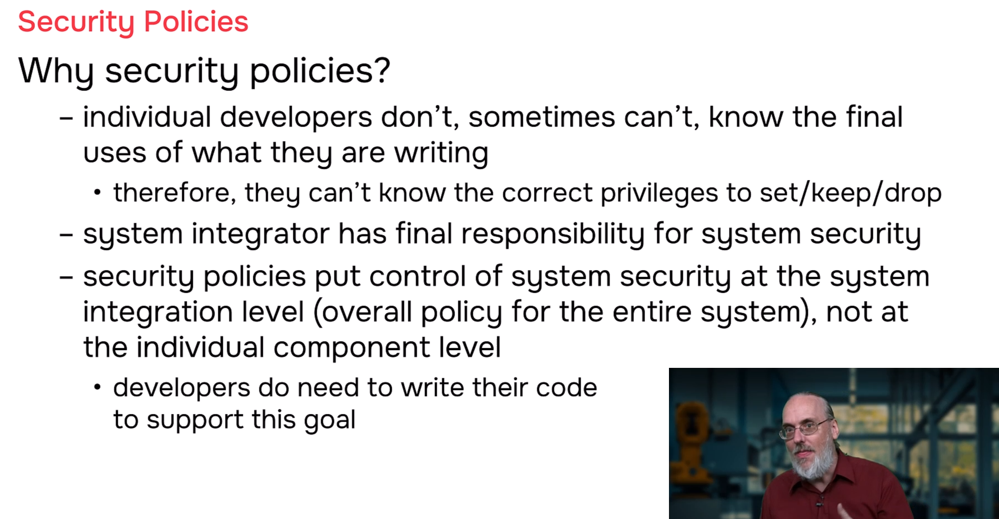
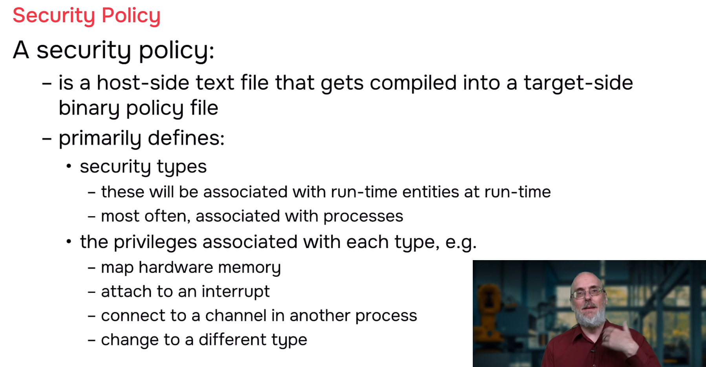
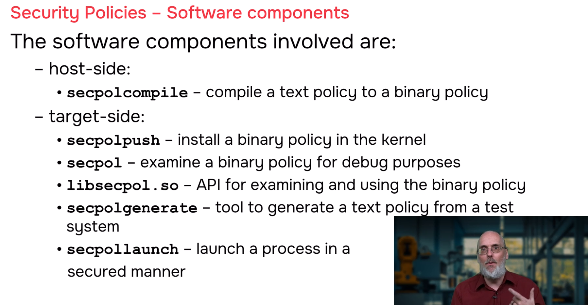
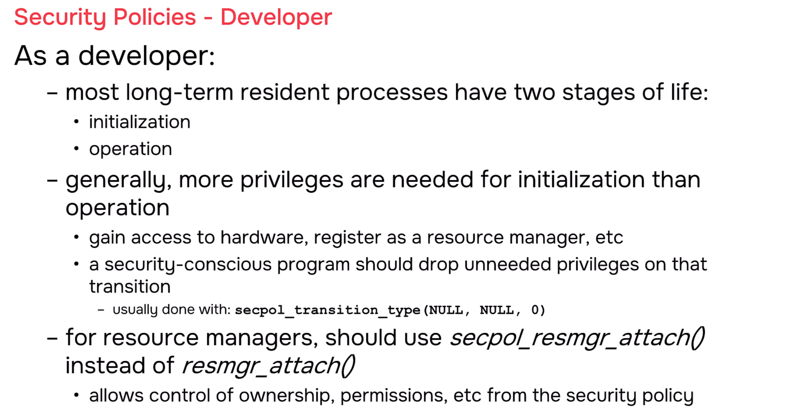
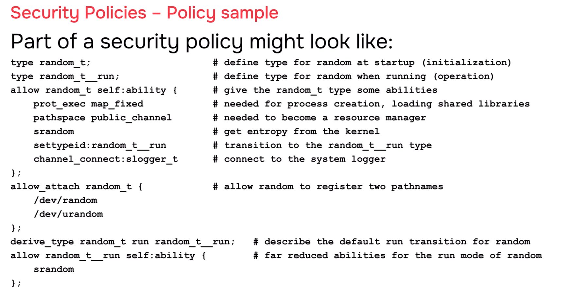

# QNX Security Policies

## Overview

This module introduces QNX operating system security policies — a framework that shifts responsibility for system security from individual developers to the **system integrator**. In traditional embedded development, programmers must guess what privileges their code will need in the final deployment. QNX security policies solve this by allowing the system integrator to define, at deployment time, exactly what privileges each process receives. This separation of concerns enables stronger security while simplifying development.

---

## Why Security Policies Are Needed

### The Developer's Dilemma

Individual developers — whether writing drivers, middleware, or applications — cannot know the final context in which their code will run. They write reusable components that may be deployed across many different systems with varying security requirements.

**Example: Serial Port Driver**

A developer writes an 8250/16550 serial port driver. The code supports configurable interrupts and memory-mapped control registers. But when the driver was written, the developer cannot know:
- Which specific interrupt number the target board will use
- Which physical address the UART registers will be mapped to
- Whether the final system needs the driver to handle multiple ports dynamically
- What other processes should be allowed to open the serial device

The driver code must be flexible enough to handle all these configurations through command-line arguments or configuration files. But the developer cannot hardcode the correct privileges because the correct privileges depend on the final deployment.

**Example: File System Driver**

A file system driver supports dynamic mounting — detecting when a USB memory stick is inserted and automatically mounting it. This requires privileges to add new names to the path namespace at runtime. But the system integrator deploying this driver might be building a fixed-configuration industrial controller where all storage devices are known at boot time and never change. In that system, the file system driver does not need dynamic mounting privileges after initialization.

The developer wrote the code to support both scenarios. Only the system integrator knows which scenario applies.

### The System Integrator's Responsibility

The final system security is the responsibility of the **system integrator** — the person or team assembling hardware from vendors like NVIDIA or Qualcomm, operating system from QNX Software Systems, middleware from third parties like ROS or AUTOSAR, and custom applications into a complete product.

The system integrator knows:
- What hardware is present
- What software components are running
- What each component needs to do
- What each component must **not** be allowed to do
- Regulatory and safety requirements for the final product

Security policies are the tool that gives the system integrator this control.

---

## What Is a Security Policy

A QNX security policy is a **host-side text file** that describes the complete security posture of a system. It is compiled into a binary format and loaded into the kernel at runtime to configure the security state of the running QNX operating system.

```
┌─────────────────────────────────────────────────────────────────────┐
│              SECURITY POLICY LIFECYCLE                                 │
│                                                                      │
│  ┌─────────────┐    ┌─────────────┐    ┌─────────────┐    ┌─────────┐
│  │  TEXT POLICY │───►│  COMPILE    │───►│  BINARY     │───►│  KERNEL │
│  │  FILE        │    │  (host)     │    │  POLICY     │    │  LOAD   │
│  │  (.pol)      │    │             │    │  (.bin)     │    │         │
│  └─────────────┘    └─────────────┘    └─────────────┘    └─────────┘
│       │                  │                  │                  │
│       │                  │                  │                  │
│       ▼                  ▼                  ▼                  ▼
│  Written by           secpolcompile      secpolpush          procnto
│  system integrator    (safety-qualified  (safety-certified   enforces
│  using knowledge of    tool)              runtime tool)        at runtime
│  final deployment
│                                                                      │
│  KEY PRINCIPLE: Developer writes code. Integrator controls security. │
│                                                                      │
└─────────────────────────────────────────────────────────────────────┘
```

### Security Types

The core concept in a security policy is the **security type** — a name assigned to runtime entities, usually processes. Each type defines what privileges processes of that type possess.

**Example: The `random` service**

The system `random` process supplies random numbers. Its security policy might define two types:

| Type | Purpose | Privileges |
|------|---------|------------|
| `random_t` | Initialization phase | Map hardware, create public channels, seed kernel random pool, connect to slogger |
| `random_t__run` | Operational phase | Only seed kernel random pool |

The process starts as type `random_t`, performs all initialization (hardware mapping, channel creation), then transitions to `random_t__run` with reduced privileges for normal operation.

---

## Privileges Controlled by Security Policies

Security policies define fine-grained privileges that replace the coarse root/not-root model:

| Privilege Category | Examples | Typical Use |
|-------------------|----------|-------------|
| **Hardware memory mapping** | Map physical addresses, DMA buffers, control registers | Device drivers accessing hardware |
| **Interrupt attachment** | Attach to specific IRQs, detach interrupts | Drivers handling hardware interrupts |
| **Path namespace** | Register resource manager names, create device entries | Drivers and services exposing interfaces |
| **Inter-process communication** | Connect to specific channels, create public channels | Services communicating with clients |
| **Process management** | Kill processes, change process types, spawn with privileges | Launchers, watchdogs, system monitors |
| **Priority manipulation** | Raise thread priority above own, set real-time policies | Time-critical control loops |
| **Tracing and debugging** | Attach to other processes, read memory, trace execution | Diagnostic tools (development only) |

---

## Security Policy Tools

QNX provides a complete toolchain for creating, compiling, deploying, and inspecting security policies.

| Tool | Location | Purpose | Certification |
|------|----------|---------|---------------|
| **secpolcompile** | Host | Compile text policy to binary format | Safety-qualified development tool |
| **secpolpush** | Target | Load binary policy into running kernel | Safety-certified runtime component |
| **secpol** | Target | Debug and inspect binary policies | Not certified (informational only) |
| **libsecpol.so** | Target | Programmatic API for policy access | Safety-certified library |
| **secpolgenerate** | Target | Generate policy from observed system behavior | Development aid (not final policy) |
| **secpollaunch** | Target | Privileged launcher for secure process startup | Secure process management |

### secpolcompile — Compiling Policies

The `secpolcompile` tool takes a text policy file written by the system integrator and compiles it into an efficient binary format for runtime use. This is a **safety-qualified tool**, meaning it meets rigorous standards for use in safety-critical systems (automotive, medical, industrial).

### secpolpush — Loading Policies

The `secpolpush` tool loads the compiled binary policy into the running QNX kernel (`procnto`). This is a **safety-certified runtime component**. Once loaded, the kernel enforces the policy on all processes.

### secpol — Inspecting Policies

The `secpol` utility provides debugging and informational capabilities. It can display the contents of a loaded binary policy, show what types are defined, what privileges each type has, and which processes are running with which types. This is **not safety-certified** — it is for development and debugging only.

### libsecpol.so — Programmatic API

The `libsecpol` library provides a **safety-certified API** for applications to interact with the security policy at runtime. Key functions include:
- Converting type names to numeric identifiers used by the kernel
- Querying current process type and privileges
- Requesting privilege transitions

### secpolgenerate — Generating Policies from Observation

Writing a complete security policy from scratch is difficult. The `secpolgenerate` tool helps by observing a running system and generating a starting policy based on what processes actually do.

**How it works:**
1. Run your complete system with all processes executing their full functionality
2. Run `secpolgenerate` to monitor behavior
3. The tool observes which privileges each process actually uses
4. It outputs a text policy file describing these observations
5. The system integrator reviews, edits, and hardens this into the final policy

**Important:** The generated policy is a **starting point**, not a final policy. It describes what the system *did*, not necessarily what it *should* be allowed to do. The integrator must review and restrict privileges further.

### secpollaunch — Secure Process Launch

Restarting components in a secured system presents a challenge: the launcher needs high privilege to start processes with specific types, but should not retain those privileges long-term. `secpollaunch` is a carefully written privileged wedge that securely launches processes with correct types and then drops its own privileges.

---

## What Developers Must Do

While security policies are primarily the system integrator's responsibility, developers must write code that supports the policy framework. Two key actions are required:

### 1. Mark Initialization-to-Operation Transitions

Most long-running processes have two life stages:
- **Initialization**: High privileges needed to set up hardware, attach interrupts, register with process manager
- **Operation**: Reduced privileges sufficient for normal function

Developers must mark this transition point in their code using `secpol_transition_type(NULL, NULL, 0)`. This tells the system: *"I am done initializing; I am ready to drop to my operational privileges."*

The exact transition is defined in the policy file by the system integrator using a **derived type rule**. The default convention appends `__run` to the initialization type name.

```
┌─────────────────────────────────────────────────────────────────────┐
│              PRIVILEGE TRANSITION PATTERN                              │
│                                                                      │
│  PROCESS LIFECYCLE:                                                   │
│  ──────────────────                                                   │
│                                                                      │
│  START ──► INITIALIZATION ──► secpol_transition_type() ──► OPERATION  │
│                                                                      │
│  Type: random_t              Type: random_t__run (derived)            │
│  Privileges:                 Privileges:                              │
│  • Map hardware memory       • Seed kernel random pool ONLY           │
│  • Create public channels    • (all other privileges dropped)         │
│  • Attach interrupts                                                 │
│  • Connect to slogger                                                │
│  • Seed random pool                                                  │
│                                                                      │
│  CODE PATTERN IN DRIVER:                                              │
│  ────────────────────────                                             │
│                                                                      │
│  int main(int argc, char **argv) {                                    │
│      // INITIALIZATION PHASE (high privilege)                         │
│      map_hardware_registers();       // needs memory_map ability        │
│      attach_interrupt(IRQ_UART);   // needs interrupt ability          │
│      resmgr_attach("/dev/random"); // needs path namespace ability    │
│      connect_to_slogger();         // needs connect ability           │
│                                                                      │
│      // MARK TRANSITION POINT                                         │
│      secpol_transition_type(NULL, NULL, 0);                          │
│      // Kernel drops privileges to random_t__run                    │
│                                                                      │
│      // OPERATION PHASE (reduced privilege)                           │
│      while (1) {                                                      │
│          generate_random_data();                                      │
│          seed_kernel_pool(data);     // only ability retained          │
│          wait_for_request();                                          │
│      }                                                                │
│  }                                                                    │
│                                                                      │
│  POLICY FILE (integrator defines):                                    │
│  ─────────────────────────────────                                    │
│                                                                      │
│  type random_t {                                                      │
│      allow ability { memory_map, public_channel, interrupt,           │
│                       connect, srandom };                             │
│      settypeid random_t__run;                                        │
│  };                                                                   │
│                                                                      │
│  type random_t__run {                                                 │
│      allow ability { srandom };                                       │
│  };                                                                   │
│                                                                      │
│  derived type {                                                       │
│      random_t → random_t__run;                                       │
│  };                                                                   │
│                                                                      │
└─────────────────────────────────────────────────────────────────────┘
```

### 2. Use secpol_resmgr_attach for Resource Managers

When writing a resource manager that registers names in the path namespace (like `/dev/serial1`, `/dev/random`), developers should use `secpol_resmgr_attach()` instead of the standard `resmgr_attach()`.

This allows the system integrator to control:
- **Ownership**: Which user ID and group ID own the device entry
- **Permissions**: What read/write/execute permissions the device has
- **Access control**: Which processes can open the device

The developer does not need to hardcode these values — they simply use the secure version of the API, and the integrator configures them in the policy.

```
┌─────────────────────────────────────────────────────────────────────┐
│              RESOURCE MANAGER ATTACH: STANDARD vs. SECURE                │
│                                                                      │
│  STANDARD (developer hardcodes — inflexible):                         │
│  ────────────────────────────────────────────                         │
│                                                                      │
│  resmgr_attach(dpp, &resmgr_attr, "/dev/random",                      │
│               _FTYPE_ANY, &connect_funcs, &io_funcs,                 │
│               _RESMGR_FLAG_BEFORE);                                    │
│  // Permissions, ownership baked into code                             │
│  // Cannot be changed by integrator without recompiling              │
│                                                                      │
│  ─────────────────────────────────────────────────────────────────   │
│                                                                      │
│  SECURE (integrator controls via policy — flexible):                  │
│  ──────────────────────────────────────────────────                   │
│                                                                      │
│  secpol_resmgr_attach(dpp, &resmgr_attr, "/dev/random",               │
│                      _FTYPE_ANY, &connect_funcs, &io_funcs,          │
│                      _RESMGR_FLAG_BEFORE);                             │
│  // Permissions, ownership defined in security policy                   │
│  // Integrator can change without touching code                        │
│                                                                      │
│  POLICY FILE (integrator defines access control):                     │
│  ─────────────────────────────────────────────────                    │
│                                                                      │
│  allow_attach {                                                       │
│      type random_t;                                                   │
│      path "/dev/random";                                              │
│      uid 100;          // owned by user "random"                     │
│      gid 100;          // group "random"                             │
│      mode 0666;        // read/write for all (or 0644, 0600, etc.)   │
│  };                                                                   │
│                                                                      │
│  Same driver code works in:                                            │
│  • Development system: permissive permissions for debugging             │
│  • Production system A: restricted to specific user/group             │
│  • Production system B: different ownership model                     │
│                                                                      │
│  No code changes needed — only policy changes.                         │
│                                                                      │
└─────────────────────────────────────────────────────────────────────┘
```

---

## Example Security Policy Structure

A security policy file contains several types of rules that work together:

```
┌─────────────────────────────────────────────────────────────────────┐
│              EXAMPLE SECURITY POLICY (Simplified)                      │
│                                                                      │
│  // Define security types                                             │
│  type random_t;                                                       │
│  type random_t__run;                                                   │
│                                                                      │
│  // Define what privileges random_t has during initialization         │
│  allow ability {                                                      │
│      type random_t;                                                   │
│      memory_map;          // Map hardware registers                   │
│      public_channel;       // Create connectable channels             │
│      interrupt;            // Attach to hardware interrupts           │
│      connect;             // Connect to other services (slogger)      │
│      srandom;             // Seed kernel random pool                │
│      settypeid random_t__run;  // Allowed to transition to run type │
│  };                                                                   │
│                                                                      │
│  // Define what privileges random_t__run has during operation         │
│  allow ability {                                                      │
│      type random_t__run;                                              │
│      srandom;             // ONLY ability: seed random pool           │
│  };                                                                   │
│                                                                      │
│  // Define path namespace registration for random device                │
│  allow_attach {                                                       │
│      type random_t;                                                   │
│      path "/dev/random";                                              │
│      uid 100;                                                         │
│      gid 100;                                                         │
│      mode 0666;                                                       │
│  };                                                                   │
│                                                                      │
│  // Define the transition from initialization to operation              │
│  derived type {                                                       │
│      random_t → random_t__run;                                        │
│  };                                                                   │
│                                                                      │
│  // Other types for other processes...                                │
│  type serial_t;                                                       │
│  type serial_t__run;                                                   │
│  // ...                                                               │
│                                                                      │
│  // Default type for unassigned processes (highly restricted)          │
│  type default_t {                                                     │
│      // Minimal privileges                                            │
│  };                                                                   │
│                                                                      │
└─────────────────────────────────────────────────────────────────────┘
```

---

## Security Policy Workflow

| Phase | Who | Action | Tools |
|-------|-----|--------|-------|
| **Development** | Developer | Write code with `secpol_transition_type()` and `secpol_resmgr_attach()` | Standard IDE, compiler |
| **Integration testing** | Integrator | Run complete system, exercise all functionality | `secpolgenerate` |
| **Policy generation** | Integrator | Generate initial policy from observed behavior | `secpolgenerate` |
| **Policy refinement** | Integrator | Review, edit, restrict privileges; define types and transitions | Text editor |
| **Policy compilation** | Integrator | Compile text policy to binary | `secpolcompile` |
| **Deployment** | Integrator | Load binary policy into running kernel | `secpolpush` |
| **Verification** | Integrator | Test that system functions correctly with restricted privileges | System tests |
| **Production** | System | Kernel enforces policy; processes run with minimal privileges | `procnto` |

---

## Summary

| Concept | Description |
|---------|-------------|
| **Security policy** | Host-side text file defining process types and privileges |
| **Security type** | Name assigned to processes defining their privilege set |
| **Privilege** | Specific system capability (memory map, interrupt, etc.) |
| **Transition** | Moving from initialization type to operational type with reduced privileges |
| **secpol_transition_type()** | Developer API to mark initialization complete |
| **secpol_resmgr_attach()** | Secure resource manager registration allowing integrator-controlled permissions |
| **secpolcompile** | Safety-qualified tool to compile policies |
| **secpolpush** | Safety-certified tool to load policies into kernel |
| **secpolgenerate** | Development tool to generate starting policies from system observation |

QNX security policies embody the principle of **least privilege** at the system level. Developers write flexible, capable code. System integrators constrain that code to exactly what each deployment needs. The result is defense in depth: even if a process is compromised, its damage is limited by the policy-defined privilege boundary.

---

## Screenshots
---











---


*Happy learning!* 🚀
